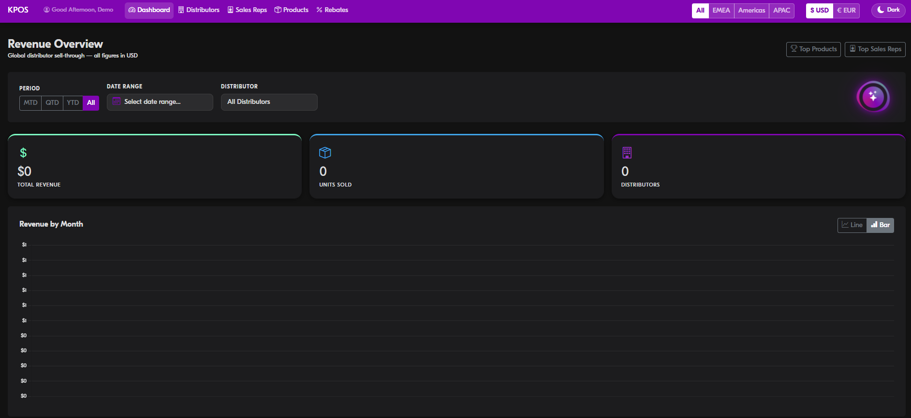
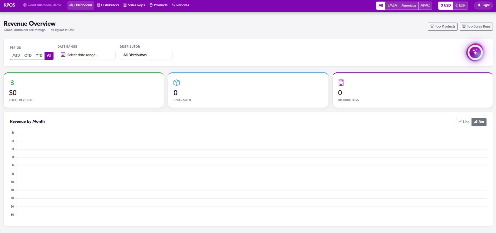
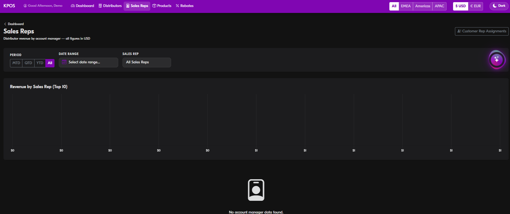
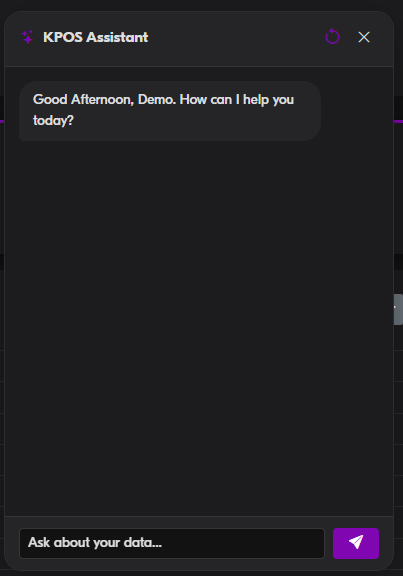

# KPos — Sales Analytics Dashboard

A sales analytics platform for tracking global distributor sell-through data. Built to replace manual Excel-based reporting — sales teams upload POS files from distributors and get instant breakdowns by region, sales rep, product, and distributor, with a built-in AI assistant for natural-language queries over the data.



## Features

**Revenue dashboard**
- Global sell-through overview: total revenue, units sold, active distributors
- Filter by period (MTD / QTD / YTD / custom date range), region (EMEA / Americas / APAC), and distributor
- Revenue by month — bar and line chart views
- USD / EUR currency toggle with live conversion



**Distributor analytics**
- Per-distributor revenue breakdown with monthly trend charts
- Jump-to-distributor navigation across all regions
- Sales rep assignment per distributor and customer

**Sales rep performance**
- Top 10 revenue ranking by account manager
- Filterable by period, date range, and individual rep



**VIR Rebates (Volume Incentive Rebates)**
- Tracks rebate attainment vs. threshold per distributor per quarter
- Classification tiers: Platinum, Standard, Dealer, Special Program
- Quarterly and YTD rebate totals, earned vs. missed


**AI assistant**
- Floating chat panel powered by Claude API
- Ask natural-language questions about your data: "Which distributor had the highest Q2 revenue?" or "Show me EMEA YTD vs last year"
- Context-aware: reads visible page data and current filters



**Data import**
- Upload standard POS Excel files from any distributor
- Automatic parsing, normalisation, and deduplication
- No manual data entry

## Tech Stack

| Layer | Technology |
|---|---|
| Backend | Django 4.2, Python 3.11 |
| Database | PostgreSQL (SQLite in demo mode) |
| Frontend | Django templates, vanilla JS |
| Auth | Azure AD SSO (demo: auto-login) |
| AI | Anthropic Claude API |
| Deployment | Docker, Azure Container Apps |

## Running Locally (Demo Mode)

No database setup or Azure account needed.

**Prerequisites:** Python 3.11+

```bash
git clone https://github.com/omricn/kpos.git
cd kpos

pip install -r requirements.txt

cp .env.example .env
# Optionally add CLAUDE_API_KEY to enable the AI assistant

python manage.py migrate
python manage.py runserver 8001
```

Open **http://localhost:8001/demo-login/** — you'll be logged in automatically as demo admin.

Upload any distributor POS Excel file from the dashboard to populate the analytics.

> The demo runs on SQLite — data resets if you run `python manage.py flush`.
